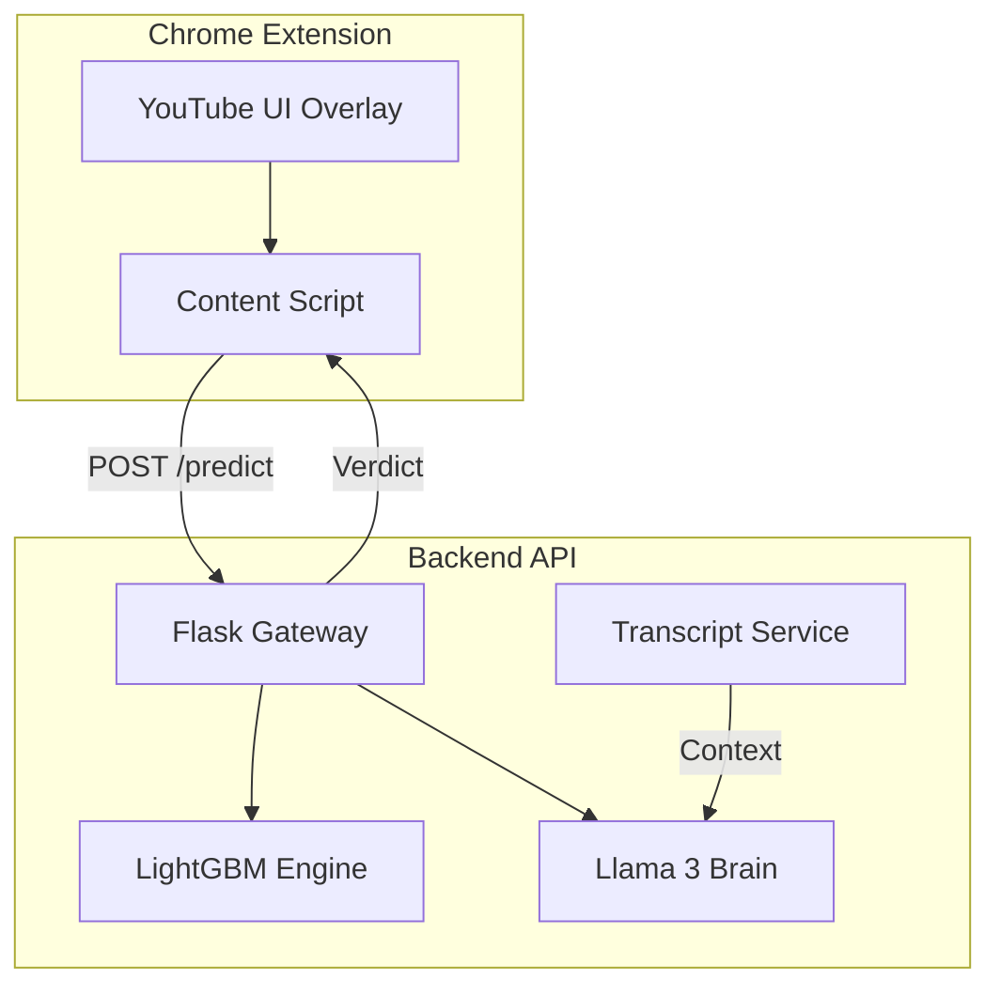
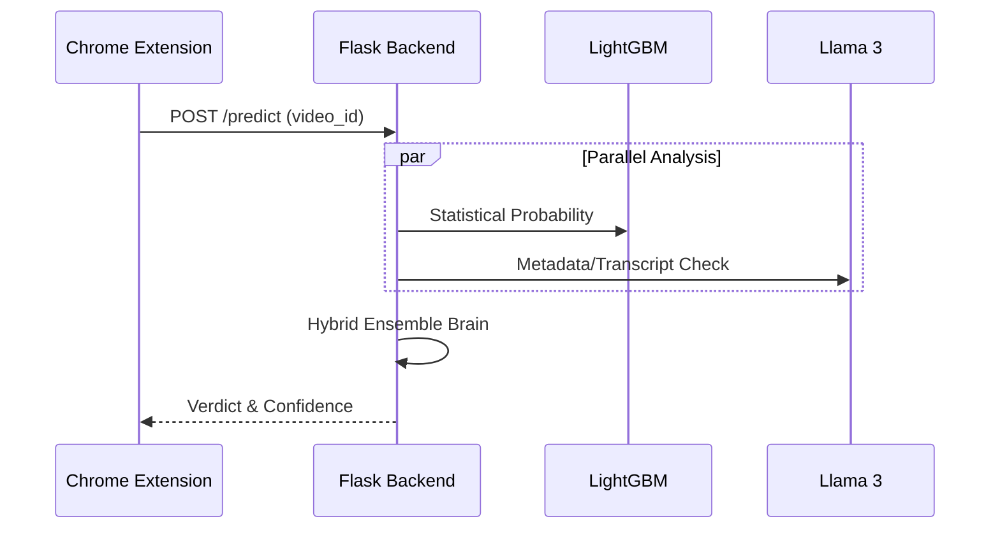

# 🎥 Clickbait Clarifier 🚀

**Stop wasting time on misleading videos.** Clickbait Clarifier uses a hybrid AI approach—combining **LightGBM Statistical Learning** with **Llama 3 Semantic Analysis**—to detect and flag deceptive YouTube content in real-time.

---

## ✨ Key Features
- **Hybrid Detection Engine:** Uses a LightGBM model trained on 55+ statistical features (engagement ratios, title-to-description consistency, etc.).
- **LLM Verification:** Deep semantic analysis via Llama 3 (Cerebras Cloud) to verify titles against transcripts.
- **Transcript Verification:** Fetches and analyzes video transcripts to find "Key Moments" where promises are fulfilled.
- **Real-Time Extension:** A sleek Chrome extension that adds status badges directly to your YouTube interface.
- **Smart Key Rotation:** Automatic rotation of Transcripts API keys to handle rate limits and quotas.

---

## 🏗️ System Architecture

### 1. High-Level Overview
The system bridges a Chrome content script with a modular Flask backend powered by high-performance AI models.



### 2. Request Flow (Sequence)


---

## 🚀 Getting Started

### 1. Backend Setup (Flask API)

1.  **Clone the Repository:**
    ```bash
    git clone https://github.com/sumedhpatil2005/AntiClickbait.git
    cd AntiClickbait/backend
    ```

2.  **Install Dependencies:**
    ```bash
    pip install -r requirements.txt
    ```

3.  **Configure API Keys:**
    - Duplicate `api_config.example.py` to `api_config.py`.
    - Add your **YouTube Data API**, **Cerebras**, and **TranscriptAPI.com** keys.

4.  **Run the Server:**
    ```bash
    python app.py
    ```

### 2. Extension Setup (Chrome)

1.  Open **chrome://extensions/** in your browser.
2.  Enable **"Developer mode"** (top right).
3.  Click **"Load unpacked"** and select the `/extension` folder from this project.
4.  Open any YouTube video and look for the detection badge below the title!

---

## 🛠️ Tech Stack
- **Frontend:** JavaScript (Chrome Extension API), CSS3 (Glassmorphism UI).
- **Backend:** Flask (Python), LightGBM, Pandas, Scikit-Learn.
- **AI Models:** Llama-3 (via Cerebras Cloud), LightGBM (Custom Trained).
- **APIs:** YouTube Data API v3, TranscriptAPI.com.

---

## 📜 Acknowledgments
- **Cerebras Cloud** for the blazing-fast Llama 3 inference.
- **TranscriptAPI** for the robust YouTube subtitle retrieval.

---
*Created with ❤️ for a safer, cleaner YouTube experience.*
