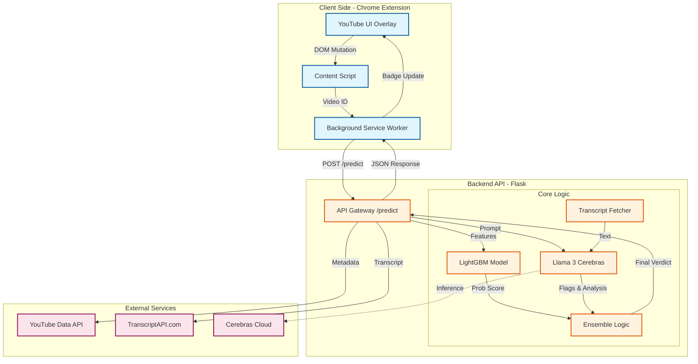
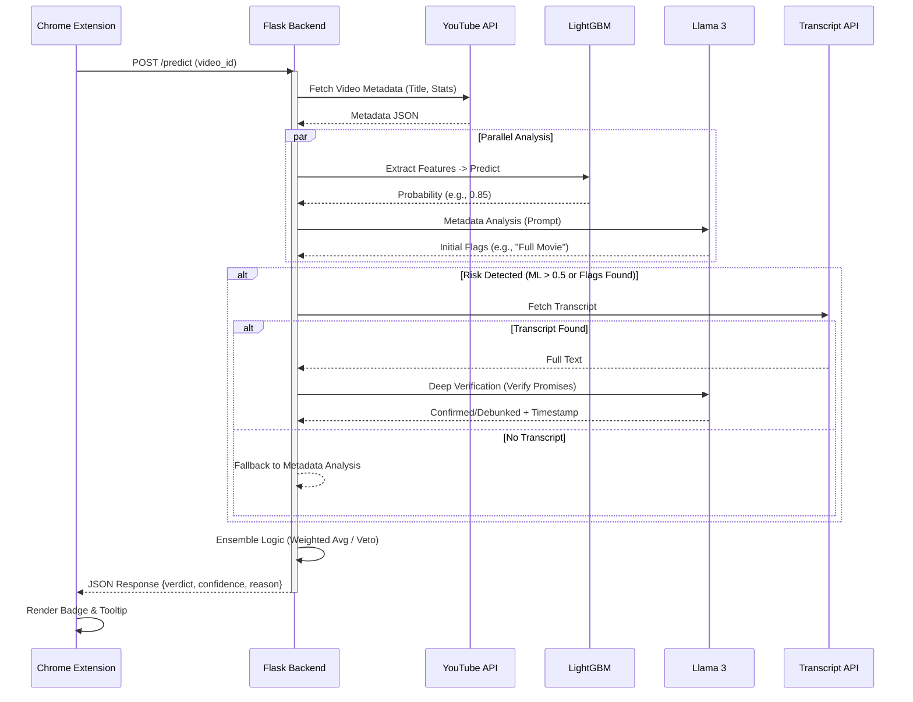
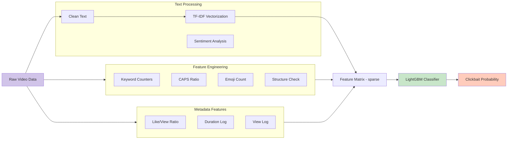
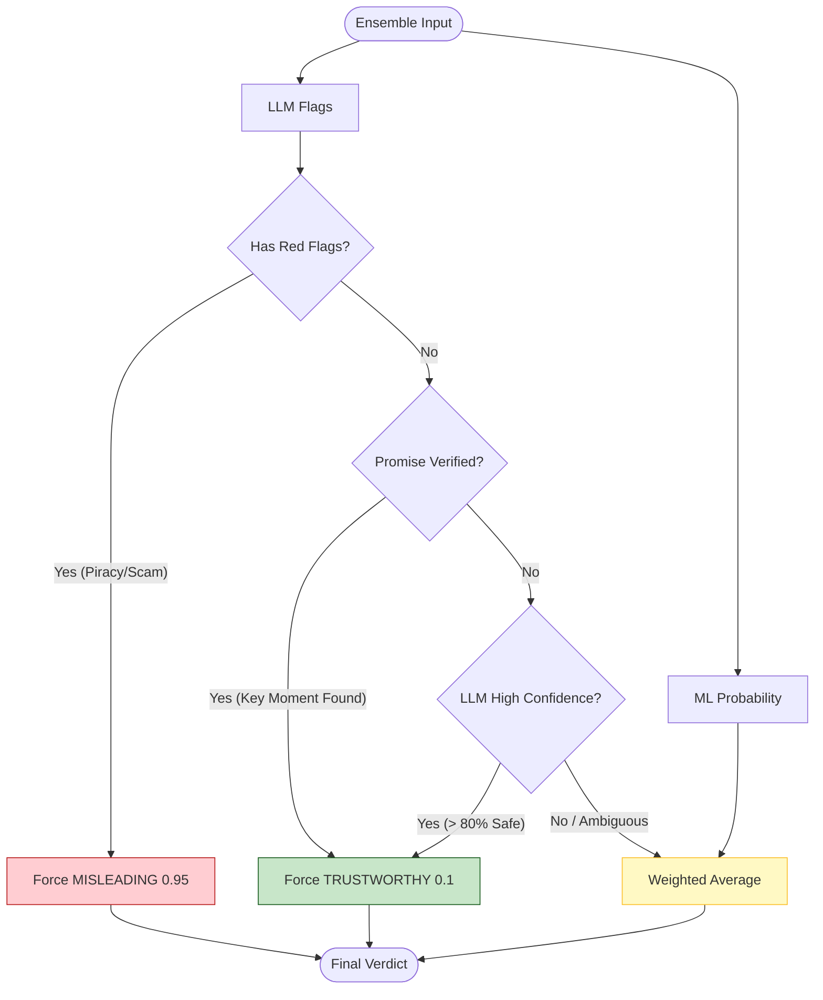

# AntiClickbait System Diagrams

## 1. High-Level System Architecture
This diagram illustrates the separation of concerns between the Chrome Extension (Frontend), Flask API (Backend), and the AI Components.

## 2. API Sequence Diagram (Request Flow)
Detailed step-by-step flow of handling a prediction request.

## 3. ML Feature Engineering Pipeline
How raw video data is transformed into the 55 features used by LightGBM.

## 4. Hybrid Ensemble Decision Logic
The "Brain" that decides the final verdict.

